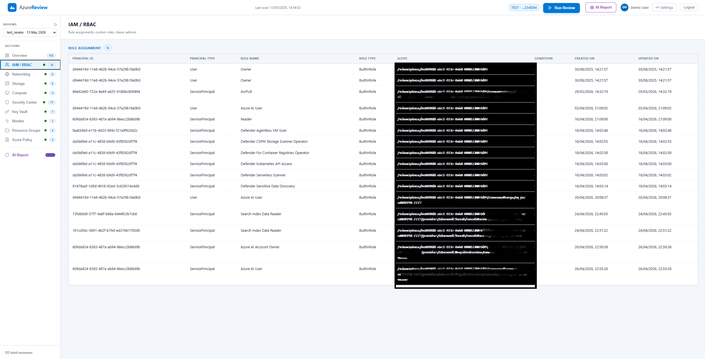
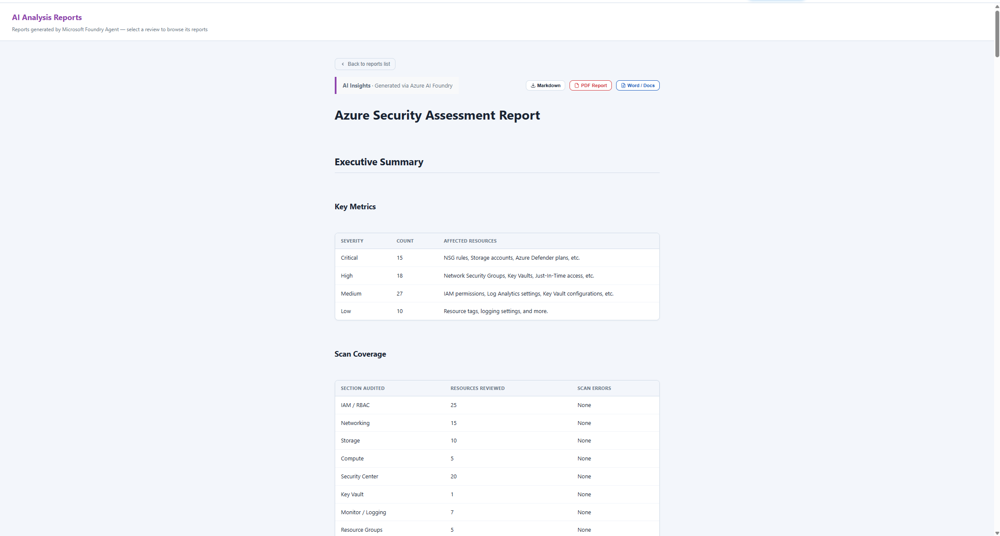
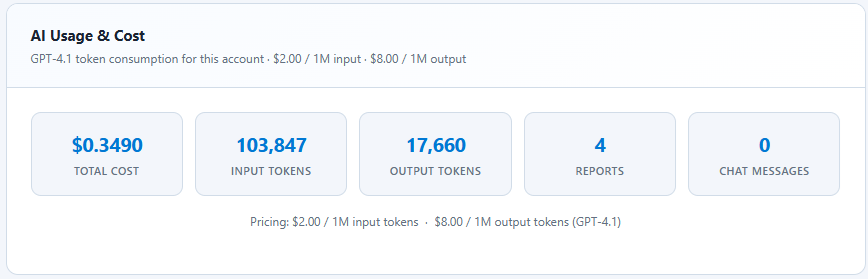
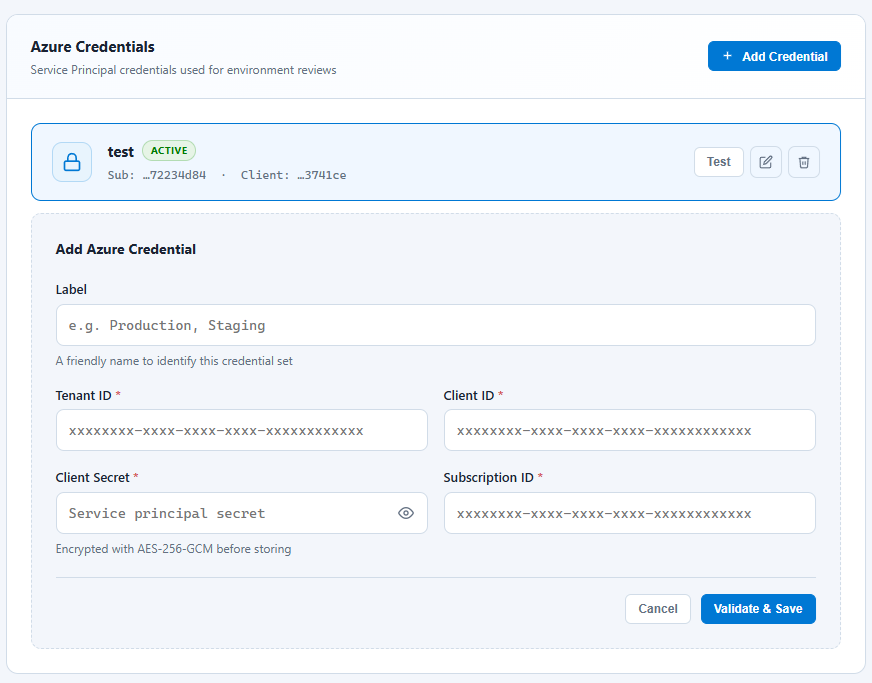

# Azure Environment Review Tool


<p align="center">
  
</p>

A comprehensive, enterprise-grade tool for auditing Azure environments. It generates deterministic security findings and synthesizes professional, client-ready security assessment reports using specialized Azure AI agents.

## ✨ Features

- **Automated Resource Discovery**: Rapidly scans Azure subscriptions across core domains (Networking, Compute, Storage, IAM, Key Vaults, etc.).
- **Deterministic Finding Engine**: Employs rigorous, rule-based checks for common security misconfigurations and best-practice violations.
- **AI-Powered Deep Analysis**: Leverages specialized Azure AI agents to conduct deep, domain-specific security analysis beyond standard rule sets.
- **Exhaustive Report Generation**: Synthesizes all findings into a high-quality Markdown report featuring executive summaries, comprehensive inventory tables, and prioritized remediation roadmaps.
- **Multi-Format Export**: Convert your security assessments into polished PDF or DOCX documents for client delivery.
- **Interactive Dashboard**: A clean, modern web interface to manage Azure credentials, trigger new reviews, and securely browse historical reports.

<p align="center">
  
</p>

---

## 🏗️ Architecture

The tool follows a robust, multi-stage review pipeline:
1. **Data Collection**: Azure SDK clients fetch detailed, granular resource configurations.
2. **Deterministic Audit**: The internal Finding Engine evaluates the raw data against predefined security baselines.
3. **Specialized AI Analysis**: Domain-specific AI agents (e.g., Compute, Networking) analyze the data to uncover complex, cross-resource risks.
4. **Master Synthesis**: A lead "Architect" AI agent compiles all deterministic and AI-driven findings into a cohesive, final report.

---

## 🚀 Getting Started

### 📋 Prerequisites

Before running the application, you must configure two external dependencies: **MongoDB** (for sessions and user data) and **Azure AI** (for the AI reporting engine).

#### 1. MongoDB Setup
The application requires a MongoDB connection. 
- **Fastest Option (MongoDB Atlas)**: Create a free cloud cluster at [mongodb.com/cloud/atlas](https://www.mongodb.com/cloud/atlas). Once created, retrieve your connection string (it will look like `mongodb+srv://<username>:<password>@cluster0...`).
- **Local Option**: Install MongoDB Community Edition and use a local connection string (e.g., `mongodb://localhost:27017/azure-review`).

#### 2. Azure AI Setup
To power the report synthesis, you need to provision resources in Azure AI Studio:
1. Navigate to [ai.azure.com](https://ai.azure.com) and sign in.
2. Create a new **Azure AI Project**.
3. **Deploy a Model**: Go to the "Deployments" section and deploy a model.
   - **Recommendation**: Deploy **`gpt-4o-mini`**. It offers the best balance of speed, cost-efficiency, and high-quality security analysis for this tool.
   - *Alternative*: You can use `gpt-4o` for even deeper reasoning, though it has higher token costs.
4. **Create an Agent**:
   - Navigate to the "Agents" or "Assistants" section within your project.
   - Create a new agent and give it a recognizable name (e.g., `ai-azure-report-generator`).
   - *Note the exact name you gave this agent; you will need it for the environment variables.*
5. **Get Project Endpoint**: In your Project Overview, copy the **Project Endpoint** URL.

<p align="center">
  
</p>

#### 3. Azure Target Credentials
You will need an Azure Service Principal (Tenant ID, Client ID, Client Secret) with at least **Reader** access to the subscriptions you wish to audit.

<p align="center">
  
</p>

---

### 💻 Installation & Configuration

1. **Clone the repository:**
   ```bash
   git clone https://github.com/azizjarrar/azure-environment-reviewer.git
   cd azure-environment-review
   ```

2. **Install dependencies:**
   ```bash
   npm install
   ```

3. **Configure Environment Variables:**
   Copy the example environment file:
   ```bash
   cp .env.example .env
   ```
   Open the `.env` file and populate it with your specific details:
   ```env
   # Required
   SESSION_SECRET="generate_a_long_random_string_here"
   MONGODB_URI="your_mongodb_connection_string_here"

   # Optional: separate encryption key for credentials at rest (falls back to SESSION_SECRET)
   ENCRYPTION_KEY="generate_another_long_random_string_here"

   # Optional: only needed for AI report generation
   PROJECT_ENDPOINT="https://<your-project>.region.inference.ai.azure.com"
   AGENT_NAME="ai-azure-report-generator"
   ```

4. **Start the Application:**
   ```bash
   npm start
   ```
   *For development with auto-reload, use `npm run dev`.*

5. **Access the Tool:**
   Open your browser and navigate to `http://localhost:3007`. 
   
   You can log in with the automatically created demo account:
   - **Email:** `demo@azurereview.com`
   - **Password:** `Demo1234!`
   
   Alternatively, you can sign up for a new account.

---

## 🤝 Contributing

Contributions make the open-source community an amazing place to learn, inspire, and create. Any contributions you make are **greatly appreciated**. 

Please see the [CONTRIBUTING.md](CONTRIBUTING.md) file for our coding standards and pull request process.

## 📄 License

This project is licensed under the ISC License. See the [LICENSE](LICENSE) file for details.
